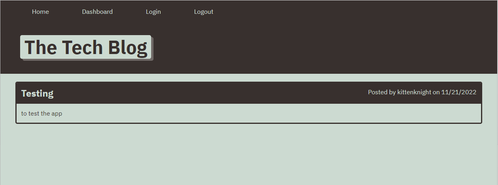
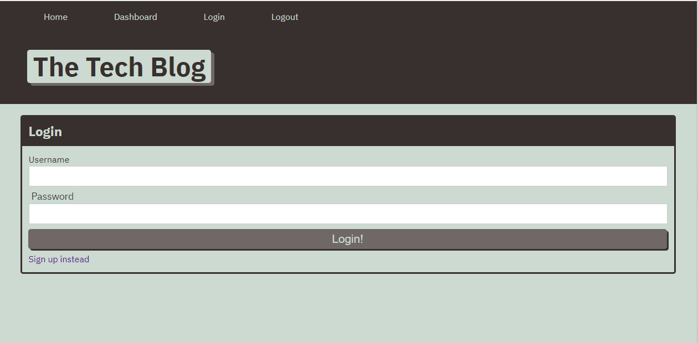
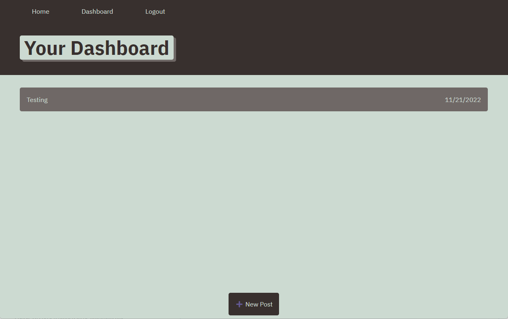
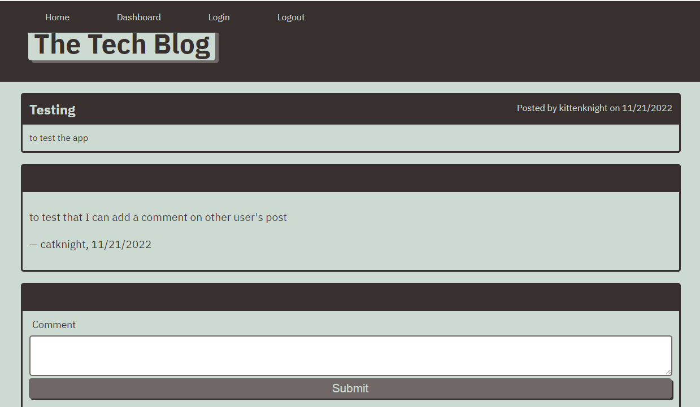

# Tech Blog

# Table of Contents
* [Project description](#description)
* [How to install the app](#installation)
* [How to use the app](#usage)
* [License](#license)

# Project description
This project is to build a CMS-style blog site so the users can publish articles, blog postes, and comment on other users' posts as well.

The app is using Handlebars.js as the templating language, Sequelize as the ORM, and the express-session npm package for authentication.

# How to install the app
* Run "npm install"
* Run "mysql -u root -p"
* After mysql login, source the schema.sql file
* Run "npm start"

# How to use the app
This app is deployed in Heroku and it is ready for users to sign-up and use. 
* Click [The Teck Blog URL](https://tech-blog-kge.herokuapp.com/), a landing page will be presented.

* User can click on either "Dashboard" or "Login" icons on the top, and it will lead to the login page, users can also choose to click "Sign up instead" to create a login.

* After user logged in successfully, user can choose to view existing postings in the Dashboard page, or add new post

* User can also add comments and thoughts on other user's posts

* User can edit or delete their own posts in the Dashboard page.

# License
MIT